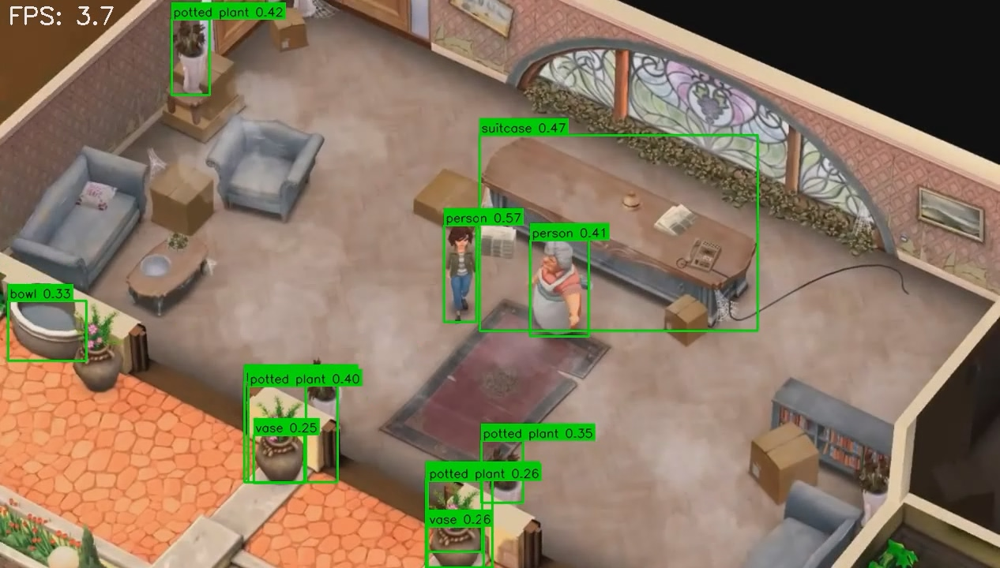

# Real-Time Object Detection with YOLO and OpenCV



---

## 📋 Project Overview

This project is a high-performance, real-time object detection application developed as part of an internship selection task. The application leverages a live webcam feed, identifies objects using the state-of-the-art YOLOv8 model and YOLO11 models, and overlays bounding boxes and class labels on the video stream. It is optimized for both CPU and GPU execution, consistently achieving frame rates well above the 20 FPS requirement.

### ✨ Key Features

- **Real-Time Detection:** Processes live video from a webcam with minimal latency.
- **High Performance:** Utilizes GPU acceleration (via CUDA) for exceptional FPS, with a robust fallback for CPU-only systems.
- **State-of-the-Art Model:** Employs `YOLOv8n`, a powerful and efficient pretrained model capable of identifying 80 common objects.
- **Dynamic FPS Counter:** An on-screen display shows the real-time processing speed.
- **Adjustable Confidence:** Easily filter out uncertain detections by modifying the confidence threshold in the code.
- **Clean & Documented Code:** The source code is well-structured, commented, and easy to understand.

---

## 🛠️ Technology Stack

- **Language:** Python 3.10+
- **Core Libraries:**
  - **OpenCV:** For video capture, frame processing, and drawing utilities.
  - **PyTorch:** As the backend deep learning framework for GPU acceleration.
  - **Ultralytics:** For seamless integration and execution of the YOLOv8 model.

---

## 🚀 Getting Started

Follow these instructions to set up and run the project on your local machine.

### Prerequisites

- An NVIDIA GPU with CUDA support is **highly recommended** for the best performance.
- Python 3.10 or newer installed.
- A connected webcam.

### Installation & Setup

**1. Clone the repository:**
```bash
git clone https://github.com/YOUR_USERNAME/YOUR_REPOSITORY_NAME.git
cd YOUR_REPOSITORY_NAME
```

**2. Create a Python virtual environment (Recommended):**
```bash
# For Windows
python -m venv venv
venv\Scripts\activate

# For macOS/Linux
python3 -m venv venv
source venv/bin/activate
```

**3. Install dependencies based on your hardware:**

#### **OPTION A: For GPU (NVIDIA)**
This is the recommended setup for high performance.

- First, install PyTorch with CUDA support by following the official instructions on the [PyTorch website](https://pytorch.org/get-started/locally/). Select the appropriate options (Pip, Windows/Linux, CUDA) to get the correct command. An example command is:
  ```bash
  pip3 install torch torchvision torchaudio --index-url https://download.pytorch.org/whl/cu121
  ```
- Then, install the remaining packages from `requirements.txt`:
  ```bash
  pip install ultralytics opencv-python
  ```

#### **OPTION B: For CPU Only**
If you do not have an NVIDIA GPU, install the CPU-only versions of the packages.
```bash
pip install -r requirements.txt
```

### Running the Application

Once the setup is complete, run the application with the following command:

```bash
python bina_task1.ipynb
```

- A window will appear showing your live webcam feed with object detections.
- The console will print which device (GPU or CPU) is being used.
- Press the **'q'** key on the active window to close the application.

---

## 💡 Potential Improvements (Bonus Ideas)

To further enhance this project, the following features could be implemented:

- **Interactive Confidence Trackbar:** Add an OpenCV trackbar to the display window, allowing the user to adjust the confidence threshold in real-time without restarting the script.
- **Object Counting:** Implement a counter to display the number of instances for specific object classes (e.g., "Persons: 3", "Cars: 1").
- **Custom Model Integration:** Allow the user to specify a path to a different pretrained or custom-trained YOLO model via a command-line argument.

- **Output Recording:** Add a feature to save the processed video feed with the bounding boxes to a file.
